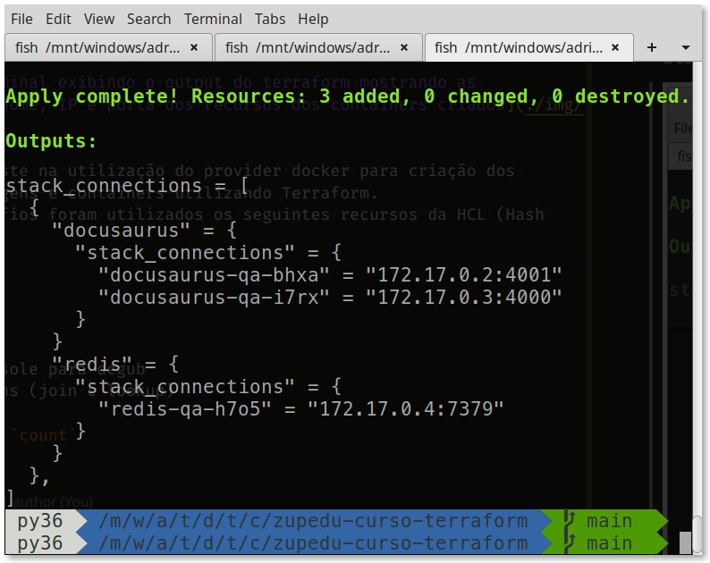

# zupedu-curso-terraform
Desafio: Fundamentos sobre Terraform da [Zup Edu](https://www.zup.com.br/zup-edu)



O desafio consiste na utilização do provider docker para criação dos recursos de imagens e containers utilizando Terraform.
Durante os desafios foram utilizados os seguintes recursos da HCL (Hash Corp Language):
- variables
- locals
- provider
- workspace
- outputs
- terraform console para degub
- build functions (join e lookup)
- foreach
- meta-argument `count`
- modules

## Tecnologias
- Terraform
- Docker
- tfenv para versionamento

## Iniciando
```bash
# clona o projeto
git clone https://github.com/adrianoavelino/zupedu-curso-terraform

# entra no diretório
cd zupedu-curso-terraform

# verifica a versão do terraform
# Obs: neste projeto é utilizado o tfenv para versionamento do Terraform.
# Para configurar o tfenv no seu computador acesse: 
# https://github.com/tfutils/tfenv
terraform -v #Terraform v1.1.9

# prepara o diretório de trabalho instalando os providers 
# necessários e etc
terraform init

# cria o workspace de dev
terraform workspace new dev

# cria o workspace de qa
terraform workspace new qa

# mostra as modificações que serão aplicadas
terraform plan

# cria ou atualiza a infraestrutura
terraform apply -auto-approve

#
# PARA CONSULTAR A ESTRUTURA CRIADA
#

# mostra os estados dos recursos criados
terraform state list

# lista os containers criados
docker ps

# para os containers e exclui todos os containers existentes
# no terminal com fish shell
docker stop (docker ps -q); docker container prune

# para os containers e exclui todos os containers existentes
# no bash
docker stop $(docker ps -q) & docker container prune
```

> A execução dos comandos está disponível no Youtube no canal [Diário de um dev](https://youtu.be/3BD_F1TSvOM)

## Links
- [Projeto final do Desafio: Fundamentos sobre Terraform](https://github.com/zup-academy/curso-terraform)
